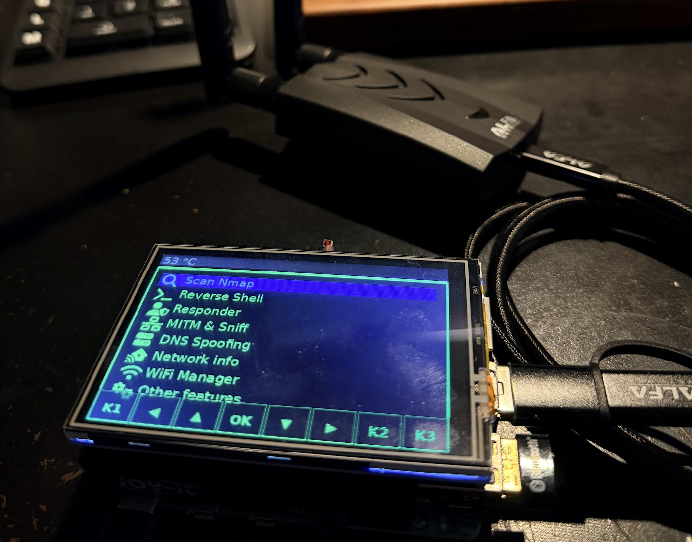

<p align="center">
  
  
  
  
</p>

<div align="center">
  <h1>RaspyJack</h1>
  
  <p><strong>Portable Raspberry Pi offensive toolkit</strong> with LCD control, payload launcher, WebUI, and Payload IDE.</p>
</div>

<div align="center">
  
  <p><em>RaspyJack on a 3.5" MPI3501 480×320 touchscreen with on-screen virtual buttons</em></p>
</div>

---

## ⚠️ Legal / Safety

RaspyJack is for **authorized security testing, research, and education only**.

- Do **not** use it on networks/systems you do not own or have explicit permission to test.
- You are solely responsible for how you use this project.
- The authors/contributors are not responsible for misuse.

---

## ✨ What RaspyJack includes

- LCD-driven handheld-style interface (Waveshare 1.44" HAT **or** MPI3501 3.5" 480×320 touchscreen)
- On-screen virtual touch buttons when using the MPI3501 (no physical joystick needed)
- Payload categories (reconnaissance, interception, exfiltration, etc.)
- Loot collection + browsing
- WebUI remote control dashboard
- Payload IDE (browser editor + run flow)
- Responder / DNS spoof tooling integration
- WiFi utilities + optional attack flows (with compatible USB dongle)

Check the WIKI for more ! https://github.com/7h30th3r0n3/Raspyjack/wiki

---

## 🧱 Hardware

## ✅ Required Hardware
<table>
  <tr>
    <th>Item</th>
    <th>Description</th>
    <th>Buy</th>
  </tr>
  <tr>
    <td><strong>Waveshare 1.44" LCD HAT</strong></td>
    <td>SPI TFT 128×128 + joystick + 3 buttons</td>
    <td>
      <a href="https://s.click.aliexpress.com/e/_c3HTOQQn">Buy</a><br/>
      <a href="https://s.click.aliexpress.com/e/_EwDqSv4">Buy</a>
    </td>
  </tr>
  <tr>
    <td><strong>MPI3501 3.5" LCD (alternative)</strong></td>
    <td>SPI TFT 480×320, ILI9486 + XPT2046 resistive touch, FBTFT framebuffer</td>
    <td>
      <a href="https://s.click.aliexpress.com/e/_oBa2coe">Buy</a>
    </td>
  </tr>
  <tr>
    <td><strong>Raspberry Pi Zero 2 WH</strong></td>
    <td>Quad-core 1 GHz, 512 MB RAM – super compact</td>
    <td><a href="https://s.click.aliexpress.com/e/_omuGisy">Buy</a></td>
  </tr>
  <tr>
    <td><strong>RPI 0W + Waveshare Ethernet/USB HUB HAT</strong></td>
    <td>3 USB + 1 Ethernet</td>
    <td><a href="https://s.click.aliexpress.com/e/_oDK0eYc">Buy</a></td>
  </tr>
  <tr>
    <td><strong>Alternative: Dual Ethernet/USB HUB HAT</strong></td>
    <td>2 USB + 2 Ethernet</td>
    <td><a href="https://s.click.aliexpress.com/e/_oCX3pUA">Buy</a></td>
  </tr>
</table>
<p><em>Note:</em> Raspyjack on RPI 0w1/2 can run headless trough WebUi, but need an ethernet module at least.</p>

---

## ➕ Other Hardware (Not Mandatory)
<table>
  <tr>
    <th>Item</th>
    <th>Description</th>
    <th>Buy</th>
  </tr>
   <tr>
    <td><strong>Raspberry Pi 3 Model B</strong> </td>
    <td>Almost same specs as RPI 0w2</td>
    <td><a href="https://s.click.aliexpress.com/e/_c4k1RESn">Buy</a></td>
  </tr>
  <tr>
    <td><strong>Raspberry Pi 4 Model B</strong> (4 GB)</td>
    <td>Quad-core 1.5 GHz, full-size HDMI, GigE LAN</td>
    <td><a href="https://s.click.aliexpress.com/e/_oFOHQdm">Buy</a></td>
  </tr>
  <tr>
    <td><strong>Raspberry Pi 5</strong> (8 GB)</td>
    <td>Quad-core Cortex-A76 2.4 GHz, PCIe 2.0 x1</td>
    <td><a href="https://s.click.aliexpress.com/e/_oC6NEZe">Buy</a></td>
  </tr>
</table>

<p><em>Note:</em> Raspberry Pi 4/5 is not fully tested yet. It should work through WebUI but screen may need adjustment. The MPI3501 display is a good option for Pi 3/4/5 as it uses the standard Linux framebuffer. Feedback is welcome.</p>

---

## 📡 WiFi Attack Requirements
<strong>Important:</strong> The onboard Raspberry Pi WiFi (Broadcom 43430) cannot be used for WiFi attacks.

<table>
  <tr>
    <th>Dongle</th>
    <th>Chipset</th>
    <th>Monitor Mode</th>
  </tr>
  <tr>
    <td><strong>Alfa AWUS036ACH</strong></td>
    <td>Realtek RTL8812AU</td>
    <td>✅ Full support</td>
  </tr>
  <tr>
    <td><strong>TP-Link TL-WN722N v1</strong></td>
    <td>Atheros AR9271</td>
    <td>✅ Full support</td>
  </tr>
  <tr>
    <td><strong>Panda PAU09</strong></td>
    <td>Realtek RTL8812AU</td>
    <td>✅ Full support</td>
  </tr>
</table>

<ul>
  <li>Deauth attacks on 2.4 GHz and 5 GHz networks</li>
  <li>Multi-target attacks with interface switching</li>
  <li>Automatic USB dongle detection and setup</li>
</ul>

---

## 📡 WiFi attack requirement (important)

The onboard Pi WiFi chipset is limited for monitor/injection workflows.
For WiFi attack payloads, use a **compatible external USB WiFi adapter**.

Examples commonly used:
- Alfa AWUS036ACH (RTL8812AU)
- TP-Link TL-WN722N v1 (AR9271)
- Panda PAU09 (RTL8812AU)

---

## �️ MPI3501 3.5" Display Support (480×320)

RaspyJack now supports the **MPI3501 3.5" 480×320 SPI touchscreen** as an alternative to the original Waveshare 1.44" HAT. This is a larger, higher-resolution display with resistive touch input.

### What changed

| Area | Details |
|---|---|
| **Display driver** | New `LCD_480x320.py` — writes PIL images to the Linux framebuffer (`/dev/fb*`) instead of bit-banging SPI. Uses the kernel FBTFT driver installed by [goodtft/LCD-show](https://github.com/goodtft/LCD-show). |
| **Touch input** | `rj_input.py` rewritten for `python3-evdev`. Reads the XPT2046 touch controller via the kernel `ads7846` overlay. Auto-loads calibration from `/usr/share/X11/xorg.conf.d/99-calibration.conf`. |
| **Virtual buttons** | Since the MPI3501 has no physical joystick/buttons, an on-screen button bar (8 buttons) is rendered at the bottom 50 px of the display. Touch zones map to UP/DOWN/LEFT/RIGHT/OK/KEY1/KEY2/KEY3. |
| **Framebuffer claiming** | `_claim_framebuffer()` stops getty, display-manager, and detaches the text console (`con2fbmap`) so RaspyJack has exclusive access to the framebuffer — no more flashing. |
| **Auto-rotation** | The MPI3501 framebuffer is natively 320×480 (portrait). The driver auto-detects this via `/sys/class/graphics/fb*/virtual_size` and rotates the image 90° before writing. |
| **Payload compatibility** | `payloads/_input_helper.py` monkey-patches `RPi.GPIO` so payloads that call `GPIO.input()` don't crash (returns "not pressed"). `rj_input.stop_listener()` releases the exclusive evdev grab before launching a payload subprocess, and re-grabs after. |
| **WebUI** | Canvas elements updated to 480×320 with 3:2 aspect ratio. Device preview is 700 px wide on desktop. Terminal moved below the screen preview. |
| **Install script** | `install_raspyjack.sh` clones `goodtft/LCD-show`, runs `LCD35-show`, disables the desktop (multi-user.target), stops getty@tty1, and detaches the console from the LCD framebuffer. |

### Environment variables

| Variable | Default | Description |
|---|---|---|
| `RJ_FB_DEVICE` | auto-detect | Force a specific framebuffer device, e.g. `/dev/fb1` |
| `RJ_FB_ROTATE` | `auto` | Override rotation: `0`, `90`, `180`, `270`, or `auto` |
| `RJ_TOUCH_SWAP_XY` | from calibration file | `1` to swap X/Y axes, `0` to disable |
| `RJ_TOUCH_CAL` | from calibration file | Comma-separated calibration: `xmin,xmax,ymin,ymax` (e.g. `3936,227,268,3880`) |
| `RJ_TOUCH_DEBUG` | `0` | `1` to log raw → calibrated touch coordinates for the first 20 touches |
| `RJ_TOUCH_BUTTONS` | `1` | `0` to hide the on-screen button bar |

### Files added / modified

```text
LCD_480x320.py          NEW   – framebuffer display driver + button bar + rotation
LCD_Config.py           MOD   – simplified (GPIO/SPI managed by kernel)
LCD_1in44.py            MOD   – compatibility shim (re-exports LCD_480x320)
rj_input.py             MOD   – evdev touch + calibration + two-tier zones + grab handoff
raspyjack.py            MOD   – safe GPIO wrapper, payload touch handoff
payloads/_input_helper.py MOD – GPIO monkey-patch, rj_input auto-start in payloads
gui_conf.json           MOD   – MPI3501 / framebuffer / evdev config
install_raspyjack.sh    MOD   – LCD-show install, console/desktop disable
web/index.html          MOD   – 480×320 canvas, layout restructured
web/app.js              MOD   – hi-DPI setup with 480×320
index.html              MOD   – 480×320 canvas, layout restructured
```

---

## �🚀 Install

From a fresh Raspberry Pi OS Lite install:

```bash
sudo apt update
sudo apt install -y git
sudo -i
cd /root
git clone https://github.com/7h30th3r0n3/raspyjack.git Raspyjack
cd Raspyjack
chmod +x install_raspyjack.sh
./install_raspyjack.sh
reboot
```

After reboot, RaspyJack should be available on-device.

---

## 🔄 Update

```bash
sudo -i
cd /root
rm -rf Raspyjack
git clone https://github.com/7h30th3r0n3/raspyjack.git Raspyjack
chmod +x install_raspyjack.sh
./install_raspyjack.sh
reboot
```

Before major updates, back up loot/config you care about.

---

## 🌐 WebUI + Payload IDE

RaspyJack includes a browser UI and IDE in `web/`.

- WebUI docs: `web/README.md`
- Main WebUI: `https://<device-ip>/` (or fallback `http://<device-ip>:8080`)
- Payload IDE: `https://<device-ip>/ide` (or `http://<device-ip>:8080/ide`)

### Local JS sanity check (dev)

```bash
./scripts/check_webui_js.sh
```

This validates syntax for:
- `web/shared.js`
- `web/app.js`
- `web/ide.js`

---

## 🎮 Input mapping

| Control | Action |
|---|---|
| UP / DOWN | Navigate |
| LEFT | Back |
| RIGHT / OK | Enter / Select |
| KEY1 | Context/extra action (varies) |
| KEY2 | Secondary action (varies) |
| KEY3 | Exit / Cancel |

---

## 📦 Project layout (high-level)

```text
Raspyjack/
├── raspyjack.py
├── web_server.py
├── device_server.py
├── rj_input.py
├── web/
│   ├── index.html
│   ├── app.js
│   ├── ide.html
│   ├── ide.js
│   ├── shared.js
│   ├── ui.css
│   ├── device-shell.css
│   └── README.md
├── payloads/
│   ├── reconnaissance/
│   ├── interception/
│   ├── exfiltration/
│   ├── remote_access/
│   ├── general/
│   ├── games/
│   └── examples/
├── loot/
├── DNSSpoof/
├── Responder/
└── wifi/
```

---

## 🤝 Contributing

PRs are welcome.

If you submit UI changes, please include:
- short description + screenshots/gifs,
- any changed routes/workflows,
- output of `./scripts/check_webui_js.sh`.

---

## 🙏 Acknowledgements

- [@dagnazty](https://github.com/dagnazty)
- [@Hosseios](https://github.com/Hosseios)
- [@m0usem0use](https://github.com/m0usem0use)

---

<div align="center">
  Build responsibly. Test ethically. 🧌
</div>
